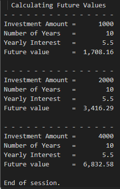

# CALC2000 (COBOL) - Future Value Investment Calculator
A small Cobol program taht calculates the future value of an investment using a fixed annual interest rate over a fixed number of years. After the first calculation, it doubles the investment amount twice, recalculating the future value each time (so you get three future-value results total).
***

## Table of Contents
  1. [Authors](#authors)
  2. [Program overviews](#what-it-does)
  3. [Cobol Concepts](#cobol-concepts)

## Authors
Dominic Mattern GitHub: [@dom987554](https://github.com/Dom987554)

## What it does
For each run, the program:
  1. Calculates the future value for the initial investment.
  2. Doubles the investment amount and calculates again.
  3. Doubles the investment amount again and calculates a third time.

The future value is cimputed iteratively (year-by-year) as:

## COBOL Concepts
 1. Program header level documentation
 2. Defining working storage data items
 3. Declaring Procedure Division Paragraphs
 4. Moving and Computing Values
 5. Displaying Output

